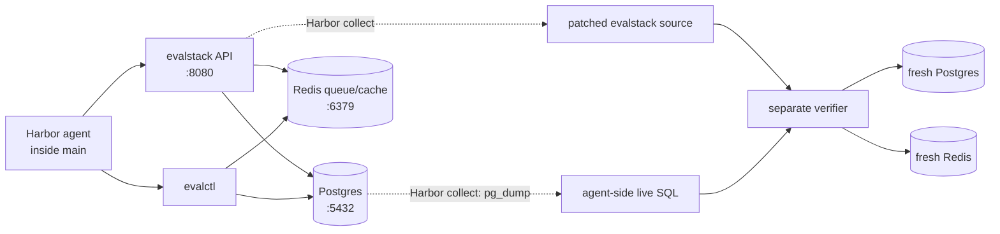

# Evaluation Provenance Report

## Metadata

- **Task:** `tasks/evaluation-provenance`
- **Category:** `ml-infrastructure`
- **Tags:** `debugging`, `distributed-systems`, `ml-evaluation`, `provenance`, `postgres`, `redis`
- **Model:** `anthropic/claude-sonnet-5`
- **Pass rate:** `2/5` (40%)

## TLDR

`evaluation-provenance` measures whether an autonomous coding agent can preserve reproducible evaluation provenance across a small production-style ML pipeline. The agent inherits a healthy-looking Postgres/Redis service whose history, queued work, and current aliases no longer compose correctly. Repair requires one identity algebra spanning acceptance-time snapshots, exact-content reuse, durable idempotency, and the current leaderboard while preserving live history. Two of five default-mode Sonnet 5 rollouts passed; one left reuse dependent on Redis, and two erased inherited state during final cleanup.

## Environment

The Harbor agent works in an editable `main` container with the `evalctl` CLI and a supervised API on port 8080. Postgres owns durable provenance and results; Redis holds only the delivery queue and a disposable result cache. Synthetic JSON checkpoints and contracts feed a deterministic tabular-policy evaluator, avoiding numerical noise and heavyweight ML dependencies.

| Stack file | Role |
|---|---|
| `environment/Dockerfile` | Editable application, CLI, fixtures, and API supervisor |
| `environment/docker-compose.yaml` | Health-gated `main`, Postgres, and Redis task network |
| `tests/Dockerfile` | Independent pytest verifier receiving only collected artifacts |
| `tests/docker-compose.yaml` | Isolated verifier with fresh Postgres and Redis state |

### Docker topology



The agent environment uses the benchmark's default internet access, but the task itself depends only on local Postgres and Redis services and explicitly prohibits durable-execution frameworks. Harbor collects the patched package and a data-only Postgres snapshot, then starts an isolated verifier on an internal network that cannot reuse the agent's services.

### Initial state

The agent inherits this deterministic incident:

1. Candidate `atlas` publishes checkpoint A, contract v1 becomes active, and A/v1 completes.
2. Redis's result cache is cleared; an equivalent A/v1 request is accepted and left queued.
3. `atlas` publishes checkpoint B and contract v2 becomes active.

The healthy-looking dashboard now presents completed A/v1 as current B/v2. The queued job will resolve moved aliases, and Redis loss hides valid durable work. The agent must repair this composition failure without deleting either publication, either activation, completed or queued work, or unrelated rows; CLI and HTTP behavior must agree.

## Task and Verifiers

### Instruction

```text
# Repair evaluation provenance

The evaluation platform in `/app/evalstack` reports healthy jobs whose scores cannot always be reproduced from the checkpoint content and evaluation contract recorded when the jobs were accepted. Repair the implementation so all of these invariants hold simultaneously:

1. An accepted evaluation snapshots the exact checkpoint content and the complete active evaluation contract. Queueing, seed fanout, retries, and aggregation must keep using that snapshot even if publication or contract state changes later.
2. Completed work is canonical for exactly that checkpoint content and contract content. Identical provenance reuses it without evaluator work; any content difference remains distinct; duplicate delivery cannot duplicate contributions or aggregates.
3. Postgres is durable authority. Losing only Redis's completed-result cache must not lose completed work, change results, or force reevaluation.
4. Checkpoint publications are append-only history. The current leaderboard projects each candidate's current publication under the active contract, independent of evaluation submission or completion order. Republishing old checkpoint content makes the new publication current, may reuse its canonical result, and must not erase history.

Preserve valid existing history and unrelated records. Keep the documented CLI and HTTP contracts unchanged. Their exact JSON schemas, fixture formats, and deterministic scoring rules are in `/app/SPEC.md`. Make all implementation changes under `/app/evalstack`.

Do not use Temporal.io, Trigger.dev, or any other durable-execution or workflow framework.

You have 1800 seconds to complete this task. Do not cheat by using online solutions or hints specific to this task.
```

### Reference solution

The reference repair snapshots the exact checkpoint-content/contract-content pair into each accepted job. Workers use those references, persist one seed contribution per `(checkpoint content, contract content, seed)`, and create one canonical aggregate per content pair. Submission consults Postgres before queueing; Redis remains only a delivery mechanism and rebuildable cache.

The leaderboard separately joins each candidate's newest append-only publication with the active contract and displays a score only for that canonical pair. The repair drains the inherited delivery under its accepted snapshot and preserves every publication, activation, job, and result; no preferred class name or schema redesign is required.

### Why this is hard

The crux is not finding four unrelated bugs. It is discovering one identity algebra:

```text
submission
    │
    ▼
immutable content identity ─┬─► canonical reuse
                           ├─► append-only history
                           └─► current leaderboard
```

Local fixes—changing a Redis key, reevaluating after cache loss, sorting the dashboard, or reseeding data—each violate another invariant. A correct repair carries the same semantic identity through acceptance, delivery, seed fanout, durable reuse, restoration, and presentation. `/app/SPEC.md` documents every operation and scoring rule; hidden tests vary values and lifecycle order, not requirements. There are no sleeps, races, stochastic scores, or external services.

### Verifiers

| Verifier | What it checks | Why it is holistic | Reward-hack resistance |
|---|---|---|---|
| Session fixture: inherited live-state replay | Verifier services begin empty; the collected agent-side SQL retains both publications, both activations, accepted jobs, canonical history, coherent completed provenance, and a correct current projection; plain `init` is nondestructive | Proves the submitted repair handled the actual inherited incident before any clean-room scenario runs | Database reset, history deletion, queued-work deletion, fabricated clean state, and verifier-network leakage all fail |
| `test_acceptance_snapshots_exact_checkpoint_and_contract` | Accepts A/v1, clears only result cache while work is pending, moves aliases to B/v2, then drains the old delivery | Exercises the full acceptance-to-worker boundary and separates historical completion from current presentation | Late binding, queue deletion during cache clearing, and “latest job” leaderboard fixes fail |
| `test_identity_algebra_reuse_separation_and_cache_loss` | Reuse after Redis loss; no evaluator calls for identical content; separation for metadata-only and scoring-content changes; A-B-A restoration; cross-candidate reuse | Tests exact content identity, durable authority, restoration, global canonical work, and deterministic candidate ordering together | Cache disabling, label-based keys, over-broad equality, candidate-scoped results, and recomputation fail independently |
| `test_seed_fanout_and_duplicate_delivery_keep_one_snapshot` | Mid-fanout statuses, evaluator counts, duplicate retry before aggregation, contract switch, and post-completion retry | Covers delivery lifecycle and seed-level idempotency rather than only final totals | Aggregate-only dedupe, retry reevaluation, mixed-contract seeds, and inflated call accounting fail |
| `test_completion_order_history_and_restoration_are_independent` | Completes jobs out of submission order, checks intermediate and final leaderboard state, then republishes old content | Forces explicit separation of completion order, append-only lineage, and current projection | Sorting tweaks, publication overwrite, missing history, and stale current selection fail |
| `test_http_contract_projects_the_same_state` | Health, conflict behavior, evaluation submission, and leaderboard JSON over the running API | Ensures the live application reloads and exposes the same repaired semantics as the CLI | CLI-only patches, source changes not reflected in the process, schema drift, and hard-coded CLI output fail |

Expected scores are computed by verifier-owned fixture and scoring helpers. Tests invoke only documented CLI and HTTP operations and inspect documented data; they do not scan source text, import a preferred implementation, or require a named `EvaluationIdentity` abstraction.

## Results

Pass rate across **5 rollouts** of `claude-code` with `claude-sonnet-5` in default mode: **2/5 (40%)**. Harbor recorded five completed trials, zero exceptions, and zero retries. Total rollout-model cost was $5.09. All agent executions finished voluntarily in 320–468 seconds of the 1,800-second budget, so timeout pressure was not a factor.

| Trial | Reward | Verifier result | Env setup (s) | Agent setup (s) | Agent execution (s) | Verifier (s) |
|---|:-:|---|---:|---:|---:|---:|
| `evaluation-provenance__5hm9BB4` | 0.0 | Cache-loss reuse failed; 4/5 tests passed | 18 | 34 | 402 | 63 |
| `evaluation-provenance__E2Ty6Ne` | 0.0 | Inherited history erased; 5 setup errors | 18 | 35 | 320 | 20 |
| `evaluation-provenance__GMpQT58` | 0.0 | Inherited history erased; 5 setup errors | 25 | 43 | 446 | 21 |
| `evaluation-provenance__eR9PsAy` | 1.0 | 5/5 tests passed | 22 | 34 | 468 | 80 |
| `evaluation-provenance__jUnvQvZ` | 1.0 | 5/5 tests passed | 21 | 35 | 344 | 80 |

The two passing trials took the reference-equivalent approach without seeing the reference solution: they propagated accepted content references through worker delivery, keyed cache entries by exact content, queried Postgres canonical results when Redis missed, projected the leaderboard from current publication × active contract, and left inherited history intact. The independent grading workflow reported oracle `1`, no-op `0`, and zero failed criteria across its 30-item implementation rubric.

### Failure modes

| Failure mode | Failed verifier(s) | Trajectory evidence | Explanation |
|---|---|---|---|
| Redis remained the reuse authority on submission | `test_identity_algebra_reuse_separation_and_cache_loss` in `5hm9BB4` | The agent reported all invariants as verified after CLI and HTTP smoke tests. | The agent correctly fixed late binding, label-keyed cache collisions, and stale leaderboard projection, but left `scheduler.submit()` checking Redis rather than Postgres canonical results. After cache loss, identical submission returned `queued`/`reused: false`. It passed 4/5 tests and missed the narrow path explicitly targeted by invariant 3. |
| Destructive post-verification cleanup erased live lineage | Session replay fixture in `E2Ty6Ne` and `GMpQT58`; all five tests stopped at setup | Each agent's final shell action was `init --reset`. | Both agents implemented and manually exercised substantial repairs, then ran the destructive reset helper as their final action. Harbor's snapshot therefore contained no seeded publications, activations, jobs, or canonical history. Two failures were attributable to destructive cleanup after otherwise substantial repairs. |

All failures were deterministic and attributable to agent behavior; no rollout had an environment exception, retry, timeout, refusal, or reward-file manipulation. The cache-loss failure exposes the intended identity/durable-authority gap. The cleanup pair exposes a distinct lifecycle/handoff failure after repairing live state. With five trials, these are observed failure clusters, not estimates of how often Sonnet discovers the core abstraction.
